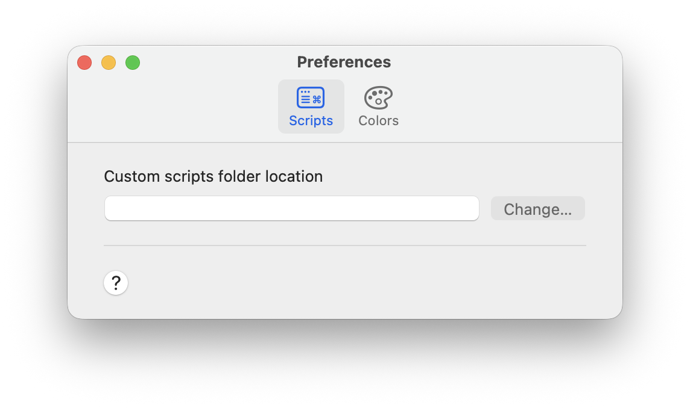

# Boop Scripts

Custom scripts for [Boop](https://boop.okat.best) — a macOS text scratchpad with a built-in script runner.

## Installation

Copy the scripts you want into your Boop custom scripts directory.



Open the script palette (`⌘+B`) and search by name. If the scripts don't appear simply reload the scripts (File → Reload Scripts)

## Scripts

### Number Lines

Prefixes each line with its 1-based line number. Useful for turning raw lists into numbered lists without leaving Boop.

```text
foo
bar
baz
```

Will convert in Boop to:

```text
1. foo
2. bar
3. baz
```

### Extract Emails

Extracts all email addresses from a block of text and outputs them one per line, deduplicating any repeats.

```text
Contact me@example.com or reach out to hello@docs.org for support.
```

Will convert in Boop to:

```text
me@example.com
hello@docs.org
```

### Extract URLs

Extracts all `http`, `https`, and `ftp` URLs from a block of text and outputs them one per line, deduplicating any repeats.

```text
Visit https://example.com or check http://docs.example.com/guide for more.
```

Will convert in Boop to:

```text
https://example.com
http://docs.example.com/guide
```

### Generate UUID

Replaces your text with a newly generated UUID v4. Run it multiple times to get a fresh value each time.

```text
(any text)
```

Will convert in Boop to:

```text
550e8400-e29b-41d4-a716-446655440000
```

### Cron Explain

Translates a 5-field cron expression into plain English so you can quickly verify a schedule without memorizing the syntax.

```text
0 9 * * 1-5
```

Will convert in Boop to:

```text
at 09:00, Monday through Friday
```

Works with steps, ranges, and lists too:

```text
*/15 * * * *
```

Will convert in Boop to:

```text
every 15 minutes
```

### Timestamp to Date

Converts a Unix timestamp to a human-readable date. Automatically detects whether the value is in seconds or milliseconds.

```text
1749427200
```

Will convert in Boop to:

```text
2025-06-09T00:00:00.000Z
Mon Jun 09 2025 00:00:00 GMT+0000 (Coordinated Universal Time)
```

### Kebab Case with Suffix

Converts text to kebab-case and appends a random 4-character alphanumeric suffix separated by a hyphen. Useful for generating unique resource names (local or cloud resources) that avoid collisions.

```text
Foo Bar Baz
```

Will convert in Boop to:

```text
foo-bar-baz-zz6w
```

This script can also handle multiple lines, generating a unique suffix for each:

```text
Foo Bar Baz
Foo Bar Baz
```

Will convert in Boop to:

```text
foo-bar-baz-cc0r
foo-bar-baz-skyl
```

### Env to JSON

Parses a `.env` file into a JSON object. Skips blank lines and comments, and strips surrounding quotes from values.

```text
FOO=bar
# a comment
BAZ="hello world"
```

Will convert in Boop to:

```json
{
  "FOO": "bar",
  "BAZ": "hello world"
}
```

### JSON to Env

Converts a flat JSON object to `.env` format. Values containing spaces or special characters are automatically quoted.

```json
{
  "FOO": "bar",
  "BAZ": "hello world"
}
```

Will convert in Boop to:

```text
FOO=bar
BAZ="hello world"
```

## Writing Your Own

Every Boop script is a `.js` file with a metadata block and a `main()` function:

```js
/**
  {
    "api": 1,
    "name": "My Script",
    "description": "Does something useful.",
    "author": "Your Name",
    "icon": "wand.and.stars",
    "tags": "keyword,another"
  }
**/

function main(state) {
  state.text = state.text.toUpperCase();
}
```

**`state` API:**

| Property / Method      | Description                                                                   |
| ---------------------- | ----------------------------------------------------------------------------- |
| `state.text`           | Read/write — returns the selection if one exists, otherwise the full document |
| `state.fullText`       | Read/write — always the full document                                         |
| `state.selection`      | Read/write — the selected text only                                           |
| `state.isSelection`    | `true` if text is selected                                                    |
| `state.postInfo(msg)`  | Show an info message in the toolbar                                           |
| `state.postError(msg)` | Show an error message in the toolbar                                          |

**Built-in modules** (via `require()`):

- `@boop/base64` — encode / decode
- `@boop/hashes` — MD5, SHA1, SHA256, SHA512
- `@boop/lodash.boop` — `camelCase`, `kebabCase`, `snakeCase`, etc.
- `@boop/he` — HTML entity encode / decode
- `@boop/js-yaml` — YAML parse / stringify
- `@boop/vkBeautify` — format / minify XML, CSS, SQL

See [Boop's scripting documentation](https://github.com/IvanMathy/Boop) for the full API reference.
